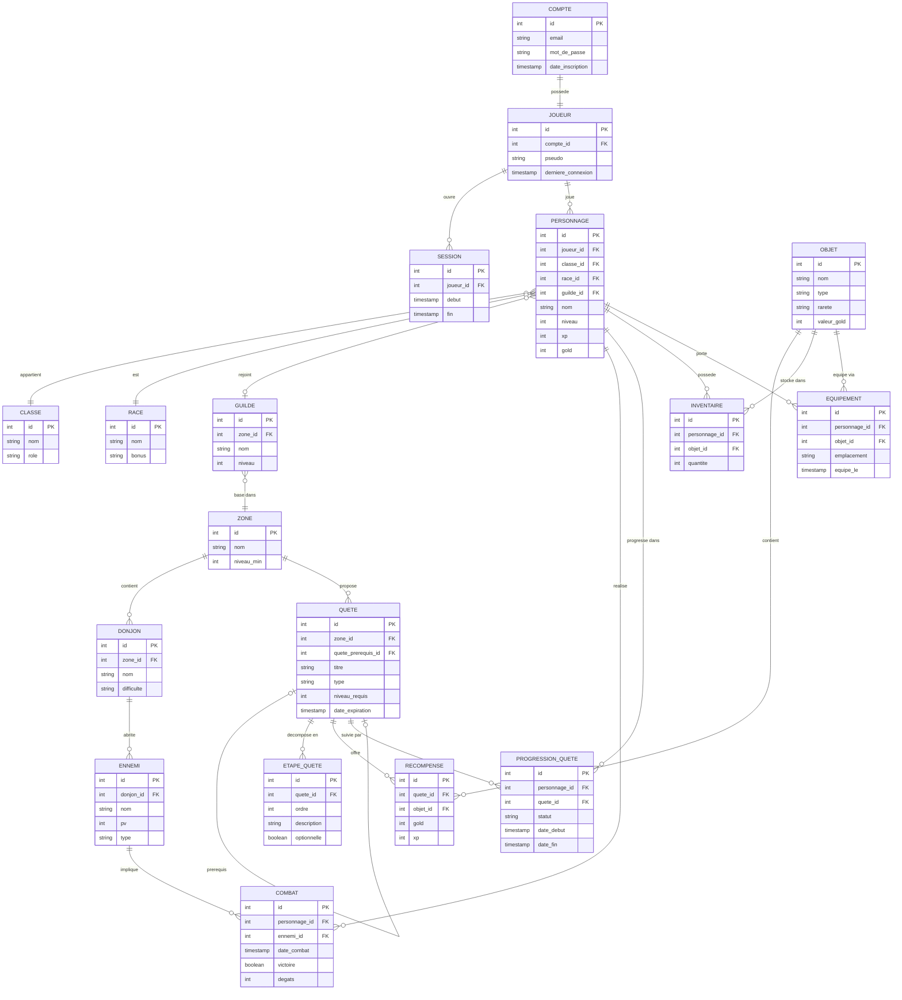

# ChronicleDB — Environnement SQL PostgreSQL 18

Stack Docker pour le cours SQL Avancé (ESGI 2025).
Fournit trois bases de données PostgreSQL et une interface pgAdmin 4.

---

## Prérequis

Selon votre configuration, deux options :

**Option A — Docker Desktop** *(recommandé si vous n'utilisez pas WSL)*

- Installer [Docker Desktop](https://www.docker.com/products/docker-desktop/) et le démarrer

**Option B — Docker dans WSL 2**

- WSL 2 activé avec une distribution Linux (Ubuntu recommandé)
- Docker installé dans WSL : [guide officiel](https://docs.docker.com/engine/install/ubuntu/)
- Toutes les commandes ci-dessous sont à exécuter **dans le terminal WSL**

---

## Structure du projet

```
chronicle_db/
├── Dockerfile                    # Image PostgreSQL 18 + Python 3
├── docker-compose.yml
├── README.md
├── init/
│   └── 00-create_databases.sql   # Point d'entrée unique — crée les bases
└── scripts/
    ├── 01-structure.sql          # Schéma : tables, index, trigger
    ├── 02-data_basics.sql        # Données de référence (jeu réduit)
    ├── 03-data_massive.sql       # Données massives (~10M combats, ~2M sessions)
    ├── 04-data_finale.sql        # Base d'examen — données statiques (désactivé)
    ├── 04_exam_generate.py       # Générateur Python — base unique par machine
    └── 04_exam_run.sh            # Script shell — lance le générateur Python
```

---

## Les trois bases disponibles

| Base                 | Description                                              | Usage                          |
|----------------------|----------------------------------------------------------|--------------------------------|
| `chronicle_simple`   | Structure + données de référence (~50 combats)           | Exercices des chapitres 1 à 4  |
| `chronicle_massive`  | Structure + données de référence + données massives      | Démos de performance (ch. 5-6) |
| `chronicle_finale`   | Base générée dynamiquement, unique par machine           | TP noté / examen final         |

> `chronicle_finale` est **commentée par défaut** dans `00-create_databases.sql`.
> Décommentez-la uniquement pour préparer ou passer le TP noté.

---

## Démarrage

### Premier lancement

La première fois, Docker doit construire l'image personnalisée (PostgreSQL 18 + Python 3) :

```bash
docker compose build
docker compose up -d
```

### Lancements suivants

```bash
docker compose up -d
```

L'initialisation des bases est **automatique** au premier démarrage et ne se rejoue pas tant que le volume `pg_data` existe.

---

## Accès

| Service    | URL                    | Identifiants               |
|------------|------------------------|----------------------------|
| pgAdmin    | http://localhost:5433  | `admin@cours.fr` / `admin` |
| PostgreSQL | `localhost:5432`       | `mj` / `moi`               |

### Connexion dans pgAdmin

Au premier lancement, ajouter un nouveau serveur avec les paramètres suivants :

| Paramètre | Valeur                            |
|-----------|-----------------------------------|
| Host      | `postgres` ⚠️ *(pas `localhost`)* |
| Port      | `5432`                            |
| Username  | `mj`                              |
| Password  | `moi`                             |

Vous pouvez ensuite basculer entre `chronicle_simple`, `chronicle_massive` et `chronicle_finale` depuis l'explorateur de bases de données.

---

## Activer la base d'examen (chronicle_finale)

Par défaut, la génération de `chronicle_finale` est désactivée pour ne pas ralentir le démarrage lors des séances d'exercices.

Pour l'activer, ouvrez `init/00-create_databases.sql` et décommentez le bloc correspondant, puis réinitialisez complètement l'environnement :

```bash
docker compose down -v    # supprime les conteneurs ET le volume
docker compose up -d      # reconstruit et réinitialise tout
```

> `chronicle_finale` est générée dynamiquement via Python à partir de l'UUID de votre machine.
> Chaque machine produit une base différente — c'est intentionnel pour le TP noté.

---

## Exécuter un script SQL

```bash
# Exemple sur chronicle_simple
docker exec -i chronicle_db-pg psql -U mj -d chronicle_simple < mon_script.sql
```

---

## Commandes utiles

```bash
# Suivre les logs d'initialisation en temps réel
docker compose logs -f postgres

# Arrêter les conteneurs (données conservées)
docker compose down

# Arrêter ET supprimer toutes les données (repart de zéro au prochain up)
docker compose down -v

# Se connecter directement en ligne de commande
docker exec -it chronicle_db-pg psql -U mj -d chronicle_simple
```

---

## Schéma de la base


